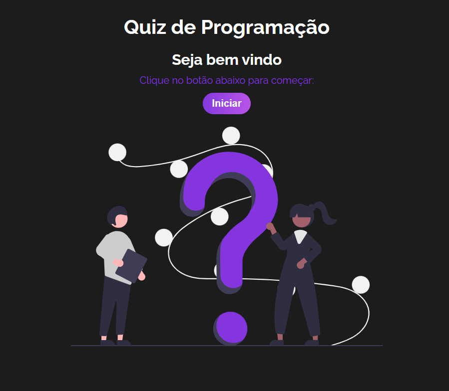

<h1 align="center">React Quiz</h1>

    Quiz desenvolvido com React utilizando useContext.

  <a href="#-tecnologias">Tecnologias</a>&nbsp;&nbsp;&nbsp;|&nbsp;&nbsp;&nbsp;
  <a href="#memo-licença">Licença</a>&nbsp;&nbsp;&nbsp;|&nbsp;&nbsp;&nbsp;
  <a href="#-contato">Contato</a>

  

 

  
  

 

## 🚀 Tecnologias

Esse projeto foi desenvolvido com as seguintes tecnologias:

  * __REACT JS__

## :memo: Licença

Esse projeto está sob a [licença MIT](LICENSE).

## :email: Contato

E-mail: [**marlonchiodelli@hotmail.com**](mailto:marlonchiodelli@hotmail.com)
---